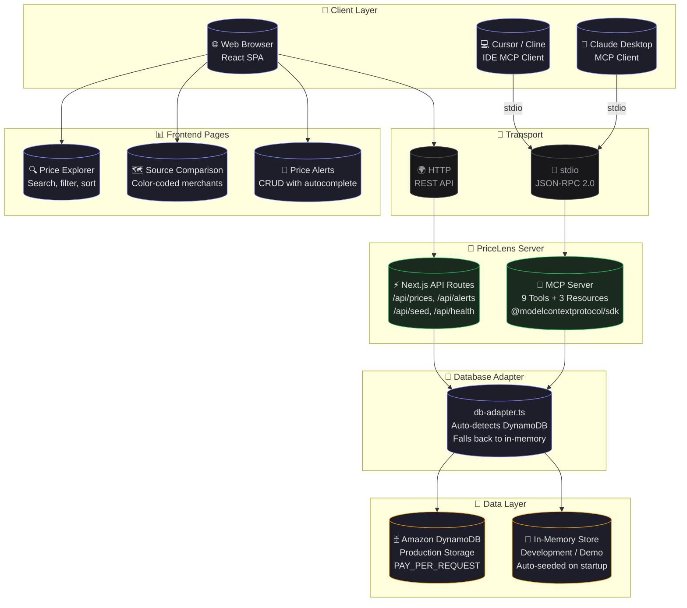
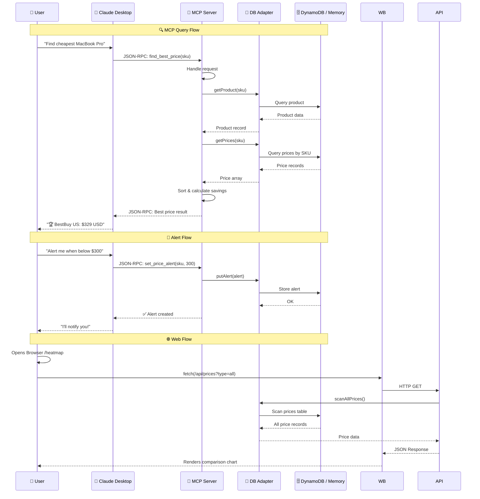
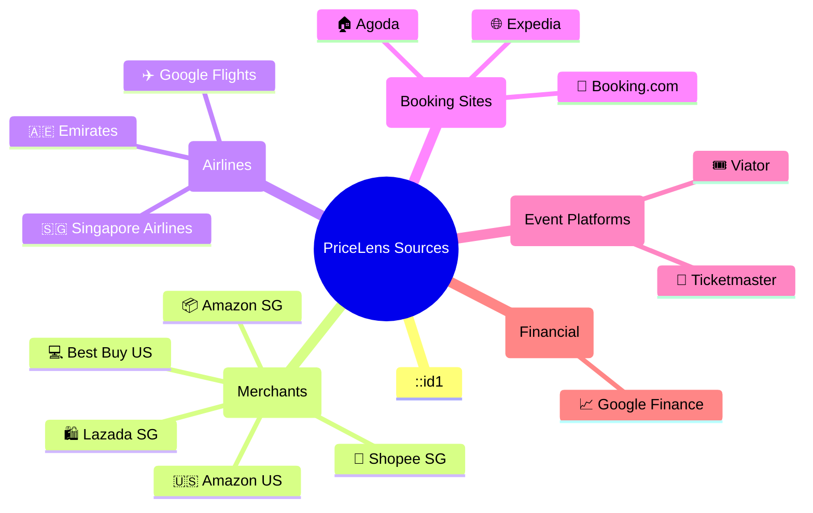
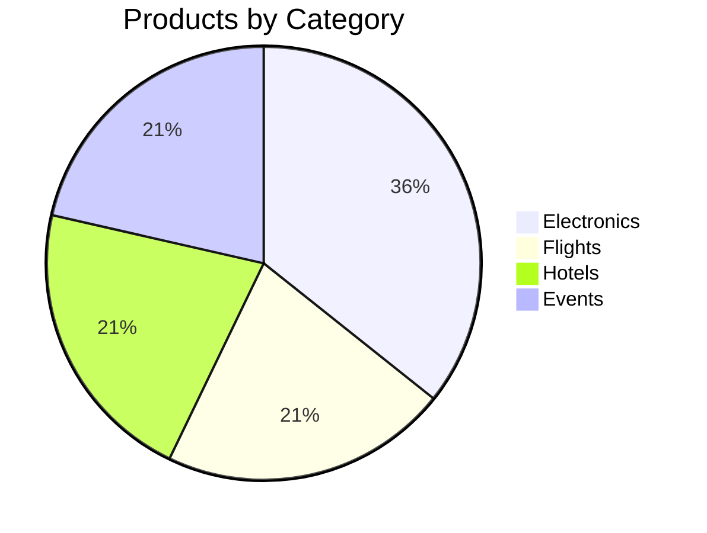
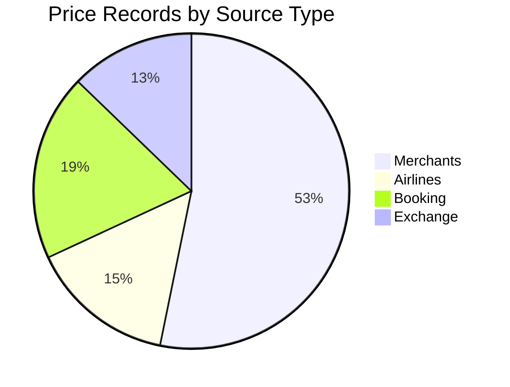

# PriceLens — Mermaid Architecture Diagrams

---

## 1. 🏗️ High-Level System Architecture (C4 Container Diagram)



---

## 2. 🗄️ DynamoDB Schema (Entity-Relationship Diagram)

```mermaid
erDiagram
    Products ||--o{ Prices : "has"
    Products ||--o{ Alerts : "monitored by"

    Products {
        string sku PK "Partition Key"
        string name "Product name"
        string category "GSI: category-index"
        list tags "Search keywords"
        map baseSpecs "Flexible attributes"
    }

    Prices {
        string sku PK "Partition Key"
        string source PK "Sort Key (merchant/airline/site)"
        number pricePerUnit "Price amount"
        string unit "Unit (unit, night, ticket, round-trip)"
        string currency "Currency code (SGD, USD, EUR)"
        number timestamp "Last updated epoch"
        string sourceType "GSI: source-index"
    }

    Alerts {
        string userId PK "Partition Key"
        string alertId SK "Sort Key (UUID)"
        string sku "Product SKU"
        string targetSource "Source or * for all"
        number targetPrice "Price threshold"
        number createdAt "Creation timestamp"
    }
```

---

## 3. 🔄 Data Flow Diagram



---

## 4. 🧩 MCP Tool Architecture

```mermaid
graph LR
    subgraph "MCP Server"
        direction TB
        LIST[("📋 ListTools\n9 tool schemas")]
        CALL[("📞 CallTool\nRoute to handler")]
        RES[("📚 ListResources\n3 resource URIs")]
        READ[("📖 ReadResource\nFetch data")]
    end

    subgraph "Tool Handlers"
        SP[("search_prices")]
        CS[("compare_sources")]
        FP[("find_best_price")]
        LC[("list_categories")]
        LP[("list_products_by_category")]
        SA[("set_price_alert")]
        LA[("list_alerts")]
        DA[("delete_alert")]
        SO[("get_source_overview")]
    end

    LIST --> CALL
    CALL --> SP
    CALL --> CS
    CALL --> FP
    CALL --> LC
    CALL --> LP
    CALL --> SA
    CALL --> LA
    CALL --> DA
    CALL --> SO

    SP --> Adapter[("🔗 db-adapter.ts\nDatabase Adapter")]
    CS --> Adapter
    FP --> Adapter
    LC --> Adapter
    LP --> Adapter
    SA --> Adapter
    LA --> Adapter
    DA --> Adapter
    SO --> Adapter

    RES --> READ
    READ --> Adapter

    Adapter --> DynamoDB[("🗄️ DynamoDB\nProduction")]
    Adapter --> Memory[("🧠 Memory Store\nDevelopment")]

    style SP fill:#1e1e2a,stroke:#818cf8
    style CS fill:#1e1e2a,stroke:#22c55e
    style FP fill:#1e1e2a,stroke:#f59e0b
```



---

## 5. 🗺️ Source/Merchant Map



---

## 6. 📊 Product Categories Breakdown





---

## How to Use These Diagrams

1. **GitHub renders Mermaid natively** — just push this file and GitHub will render the diagrams automatically.
2. **VS Code** — install the "Markdown Preview Mermaid Support" extension.
3. **Mermaid Live Editor** — paste any diagram into [mermaid.live](https://mermaid.live) to edit and export as SVG/PNG.
4. **For the hackathon submission** — take screenshots of these diagrams and include them in your submission.
